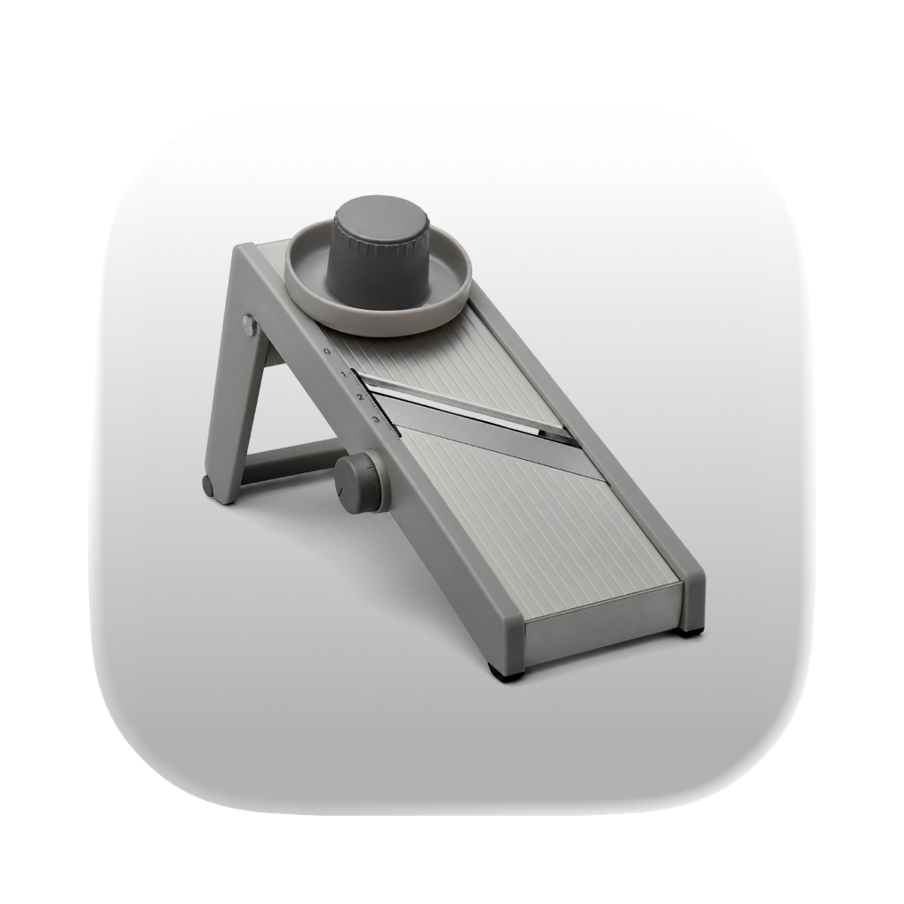

# Mandoline 🥒

A lightning-fast macOS drive triage utility designed to help you slice through storage clutter. Mandoline provides a dedicated, focused interface to review media files using rapid-fire keyboard shortcuts—letting you keep, delete, or undo actions seamlessly.



## Download

Ready to use? Download the latest compiled macOS app from the root of this repository:

👉 **[Download Mandoline.dmg](./Mandoline.dmg)**

*(Note: Because this is an independently distributed app without an Apple Developer signature, Gatekeeper will warn you when opening it. You can bypass this by right-clicking `Mandoline.app` in your Applications folder and selecting "Open").*

## Features

- **Blazing Fast Review**: Instantly view images and videos sequentially.
- **Keyboard-First Workflow**: Never touch the mouse while triaging.
  - `Space` or `→` (Right Arrow): Keep the file and move to the next.
  - `Delete` / `Backspace`: Move the file to the Trash.
  - `⌘ + Z` or `←` (Left Arrow): Undo the last action and return to the previous file.
- **Sandboxed Security**: Designed safely using macOS native APIs.

## Building from Source

Mandoline uses [XcodeGen](https://github.com/yonaskolb/XcodeGen) to manage its Xcode project.

1. Install XcodeGen:
   ```bash
   brew install xcodegen
   ```
2. Generate the project:
   ```bash
   xcodegen
   ```
3. Open `Mandoline.xcodeproj` and build!

## Distributing

If you make changes and want to generate a new `.dmg` to distribute:

1. Install `create-dmg`:
   ```bash
   brew install create-dmg
   ```
2. Build the Release app:
   ```bash
   xcodebuild -project Mandoline.xcodeproj -scheme Mandoline -configuration Release clean build SYMROOT="$(PWD)/build"
   ```
3. Package it:
   ```bash
   create-dmg \
     --volname "Mandoline" \
     --window-pos 200 120 \
     --window-size 600 400 \
     --icon-size 128 \
     --app-drop-link 400 185 \
     --icon "Mandoline.app" 150 185 \
     "Mandoline.dmg" \
     "build/Release/Mandoline.app"
   ```

## License

Standard MIT License. See `LICENSE` for more information.
